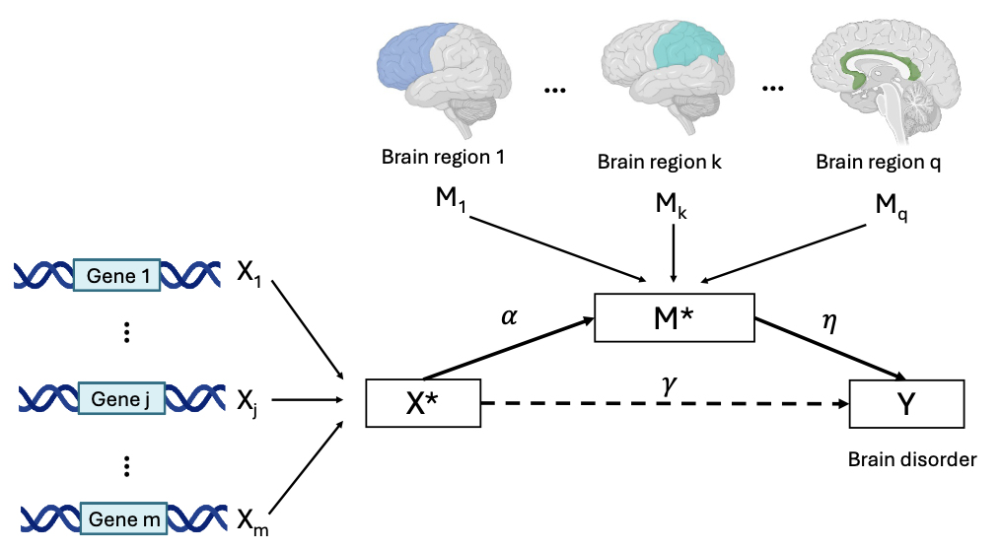

MEMM
===
This R package provides a simulation and estimation framework for high-dimensional multivariate mediation analysis, integrating exposure, mediator, and outcome data through a penalized joint model solved by ADMM (Alternating Direction Method of Multipliers).
It supports realistic simulation of correlated omics-style data, cross-validated tuning of regularization parameters, and evaluation of mediation performance metrics such as accuracy, precision, recall, F1-score, and estimated mediation proportion (MP).



R Code Overview
===========
The R implementation provides a complete workflow for simulating data, fitting the MEMM model, selecting tuning parameters, and evaluating model performance. The core pipeline is organized around the following key functions.
### `simulate_data()`
Generates synthetic exposure--mediator--outcome data under user-specified simulation settings, including the number of exposures and mediators, correlation structures, noise levels, signal strength, and mediation pathway type.
The function supports complete mediation, partial mediation, and no-mediation settings by modifying the underlying true parameters \(\alpha\), \(\eta\), and \(\gamma\). It also allows reviewer-requested extensions such as heavy-tailed exposure and mediator-noise distributions.
**Main output:** standardized matrices `X`, `M`, and `Y`, together with the true active exposure and mediator sets and true parameter objects used for benchmarking.
### `optimize_weights()`
Implements the core ADMM-based MEMM optimization algorithm. It estimates the sparse exposure and mediator loading vectors, denoted by `a` and `b`, under normalization constraints.
The objective combines model-fitting terms, a mediation-proportion component controlled by `lambda_n`, and sparsity-inducing \(L_1\) penalties controlled by `lambda_a` and `lambda_b`.
**Main output:** estimated loading vectors `a` and `b`.
### `cv_select_lambda()`
Performs \(K\)-fold cross-validation to select the regularization parameters `lambda_a` and `lambda_b` over a user-specified grid. The selected tuning parameters minimize the average prediction residual sum of squares across validation folds.
**Main output:** selected values of `lambda_a` and `lambda_b`, together with the full cross-validation error grid.
### `run_simulation_with_cv()`
Serves as the main simulation wrapper. For each Monte Carlo replicate, it generates data, selects tuning parameters, fits MEMM, estimates the mediation proportion, and computes performance metrics.
The reported metrics include mediation proportion, absolute MP bias, accuracy, precision, recall, F1-score, \(L_2\) estimation errors for `a` and `b`, and cosine similarities for directional recovery.
**Main output:** a data frame containing performance metrics for all simulation replications.
### `run_scenario_grid()`
Runs repeated simulations over a user-defined grid of scenarios. This function is used for the main simulation settings and reviewer-requested extensions, including heavy-tailed robustness, initialization sensitivity, strong-signal settings, high-correlation settings, and the high-dimensional \(m \ge n\) setting.
**Main output:** scenario-level summary results.

Installation
===
To install the MEMM package, you will first need to install devtools package and then execute the following code:
```
#install.packages("devtools")
library(devtools)
install_github("nwang123/MEMM")
```
Usage
===========
The following help page will also provide quick references for TIPS package and the example command lines:
```
library(MEMM)
```

Output
===========
The simulation workflow returns either replicate-level results or scenario-level summaries, depending on the function used.
Typical output includes:
- `MP`: estimated mediation proportion;
- `true_MP`: true mediation proportion used in the data-generating mechanism;
- `AbsBias_MP`: absolute bias of the estimated mediation proportion;
- `Accuracy`, `Precision`, `Recall`, and `F1`: support-recovery metrics;
- `Cosine_avg`: average of `Cosine_a` and `Cosine_b`;
- selected tuning parameters, where applicable, including `lambda_a` and `lambda_b`;
- fitted loading vectors `a` and `b`, where applicable.
For real-data analysis, the workflow returns the estimated exposure and mediator loading vectors, selected tuning parameters, and ranked active exposures and mediators. The individual-level real data are not included in this repository due to controlled-access data-use restrictions.

Development
===========
This R package is developed by Neng Wang.
