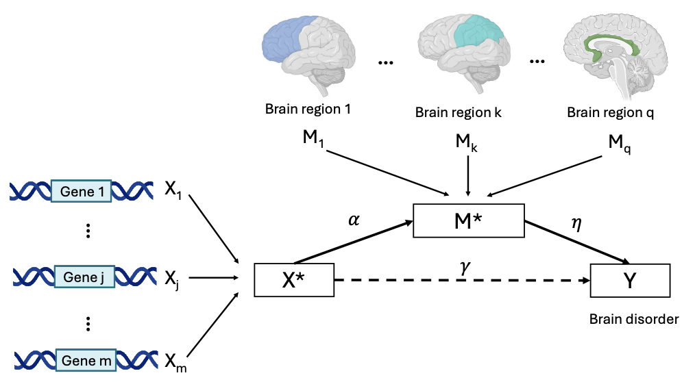

MEMM
===
**Draft optimizer correction:** the admissible Equation (4) implementation passes
its code checks. Preservation of the manuscript's numerical results has not
been established; see [synthetic validation findings](docs/validation.md).

This R package provides a simulation and estimation framework for high-dimensional multivariate mediation analysis, integrating exposure, mediator, and outcome data through a penalized joint model solved by ADMM (Alternating Direction Method of Multipliers).
It supports realistic simulation of correlated omics-style data, cross-validated tuning of regularization parameters, and evaluation of mediation performance metrics such as accuracy, precision, recall, F1-score, and estimated mediation proportion (MP).



R Code Overview
===========
The R implementation provides a complete workflow for simulating data, fitting the MEMM model, selecting tuning parameters, and evaluating model performance. The core pipeline is organized around the following key functions.
### `simulate_data()`
Generates synthetic exposure--mediator--outcome data under user-specified simulation settings, including the number of exposures and mediators, correlation structures, noise levels, signal strength, and mediation pathway type.
The function supports complete mediation, partial mediation, and no-mediation settings by modifying the underlying true parameters \(\alpha\), \(\eta\), and \(\gamma\). It also allows reviewer-requested extensions such as heavy-tailed exposure and mediator-noise distributions.
**Main output:** standardized matrices `X`, `M`, and `Y`, together with the true active exposure and mediator sets and true parameter objects used for benchmarking.
### `optimize_weights()`
Implements the core ADMM-based MEMM optimization algorithm. It estimates the sparse exposure and mediator loading vectors, denoted by `a` and `b`, under normalization constraints.
The objective combines model-fitting terms, a mediation-proportion component controlled by `lambda_n`, and sparsity-inducing \(L_1\) penalties controlled by `lambda_a` and `lambda_b`.
**Main output:** estimated loading vectors `a` and `b`.
### Equation (4), admissible region, and scope of Theorem 1
`R/MEMM.R` now contains a single explicit objective evaluator,
`memm_objective()`. With centered data and `||X a|| = ||M b|| = 1`, it evaluates

```text
Phi(a,b) = [SSR(Y~Xa) + SSR(Mb~Xa) + SSR(Y~Xa+Mb)/(1-alpha^2)]/(2*n)
           - lambda_n*(alpha*eta/tau) + lambda_a*||a||_1 + lambda_b*||b||_1.
```

`memm_profile()` recomputes the OLS coefficients at each loading pair.
The MP term is signed and is neither replaced by its absolute value nor clipped.
`memm_smooth_gradient()` differentiates this profiled objective, including the
`1/(2*n)` factor. `tests/check_admissible.R` compares the objective against
independent OLS fits and the gradients against numerical derivatives.

The admissible region is the unit-aggregate normalization together with
`tau >= r0` and `1-alpha^2 >= delta`. The default bounds `r0=1e-6` and
`delta=1e-6` are numerical choices, not empirically validated thresholds;
`r0` depends on the scale of the outcome. Set them explicitly for the analysis.
No additional loading constraints are implemented.

`memm_initialize()` constructs a feasible initial pair or fails explicitly.
Loading updates use tangent descent, normalization, and backtracking. Every
accepted trial must lie in the relevant feasible slice and decrease its block
augmented objective. If no acceptable step is found, the previous feasible
loading is retained and `stalled_blocks` is incremented. These are **inexact
numerical block updates**, not certified solutions of Algorithm 1's exact
argmin subproblems. The auxiliary variables are unconstrained by this region;
the scaled dual convention is `u = y/rho`.

Theorem 1 remains **conditional**. Enforcing the admissible region does not
verify its sufficient-decrease, relative-error, or additional geometric
conditions for the implemented algorithm. A small ADMM residual is a numerical
stopping diagnostic, not a stationarity certificate. Objective and residual
histories can reveal failures of assumptions but cannot establish the
infinite-sequence or neighborhood conditions. A block update can stall at a
constraint boundary without establishing joint stationarity.

```r
source("R/MEMM.R")
fit <- optimize_weights(X, M, Y, lambda_n=0.1, lambda_a=0.2, lambda_b=0.3,
                        r0=1e-6, delta=1e-6, max_iter=500)
fit$profile$MP
fit$objective
fit$termination
fit$diagnostics
fit$history
# CV/restart/simulation wrappers accept the same controls through:
# optimizer_control = list(r0=1e-6, delta=1e-6, inner_max_iter=20)
```

The optimizer centers its inputs and returns the training means in `centers`.
Public objective/gradient helpers expect already-centered data and normalized
loadings. Restarts are ranked by the same penalized Equation (4). Validation
predictions use training coefficients and training means, without refitting on
held-out outcomes. Source files no longer auto-install optional packages.

This revision changes the legacy objective gradients and validation procedure
as well as enforcing feasibility. Its effect on the manuscript's results has
**not** been established; unchanged results must not be assumed. Rerun the
actual analysis with fixed data, tuning values and seeds, retain iteration
histories, and separately compare any full retuning analysis. The synthetic
comparison in `tests/compare_legacy.R` is a diagnostic, not a reproduction of
the paper's results. These optimizer checks do not validate the legacy
simulation generators or comparative-table estimands.

### `cv_select_lambda()`
Performs \(K\)-fold cross-validation to select the regularization parameters `lambda_a` and `lambda_b` over a user-specified grid. The selected tuning parameters minimize the average prediction residual sum of squares across validation folds.
**Main output:** selected values of `lambda_a` and `lambda_b`, together with the full cross-validation error grid.
### `run_simulation_with_cv()`
Serves as the main simulation wrapper. For each Monte Carlo replicate, it generates data, selects tuning parameters, fits MEMM, estimates the mediation proportion, and computes performance metrics.
The reported metrics include mediation proportion, absolute MP bias, accuracy, precision, recall, F1-score, \(L_2\) estimation errors for `a` and `b`, and cosine similarities for directional recovery.
**Main output:** a data frame containing performance metrics for all simulation replications.
### `run_scenario_grid()`
Runs repeated simulations over a user-defined grid of scenarios. This function is used for the main simulation settings and reviewer-requested extensions, including heavy-tailed robustness, initialization sensitivity, strong-signal settings, high-correlation settings, and the high-dimensional \(m \ge n\) setting.
**Main output:** scenario-level summary results.

Installation
===
To install the MEMM package, you will first need to install devtools package and then execute the following code:
```
#install.packages("devtools")
library(devtools)
install_github("nwang123/MEMM")
```
Usage
===========
Load the package with:
```
library(MEMM)
```

Output
===========
The simulation workflow returns either replicate-level results or scenario-level summaries, depending on the function used.
Typical output includes:
- `MP`: estimated mediation proportion;
- `true_MP`: true mediation proportion used in the data-generating mechanism;
- `AbsBias_MP`: absolute bias of the estimated mediation proportion;
- `Accuracy`, `Precision`, `Recall`, and `F1`: support-recovery metrics;
- `Cosine_avg`: average of `Cosine_a` and `Cosine_b`;
- selected tuning parameters, where applicable, including `lambda_a` and `lambda_b`;
- fitted loading vectors `a` and `b`, where applicable.
For real-data analysis, the workflow returns the estimated exposure and mediator loading vectors, selected tuning parameters, and ranked active exposures and mediators. The repository includes example data files and an illustrative fixed-tuning script in `real data/`; this example is not certified to reproduce the manuscript analysis.

Development
===========
This R package is developed by Neng Wang.

